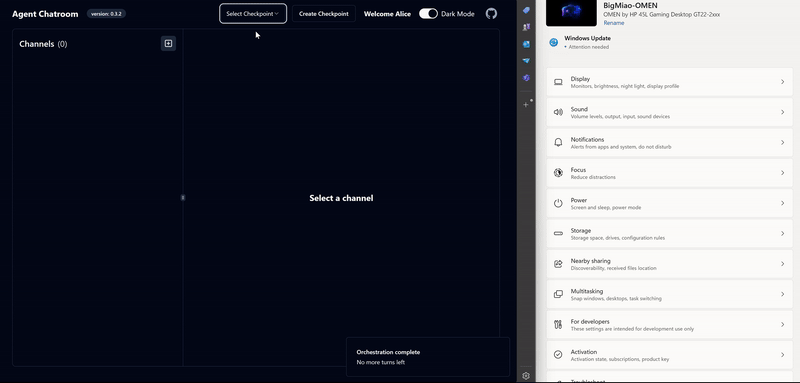
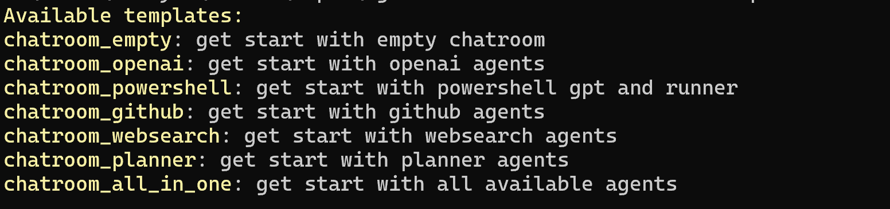
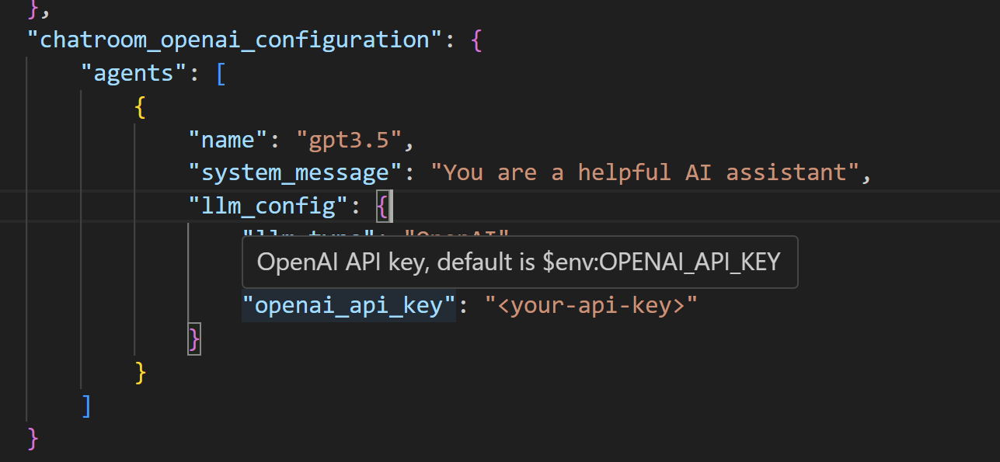

## Agent Chatroom
#### An extensible multi-agent platform built on top of AutoGen.Net, shadcn and Orleans.

[](https://badge.fury.io/nu/ChatRoom.Client) | [website](https://littlelittlecloud.github.io/Agent-ChatRoom/) | Join our [Discord](https://discord.gg/UYwcVfGaeq)



## 🌟 Highlights
- **Multi-Agent WebUI**: Chat with multiple agents simultaneously in a web browser.
- **Code-First**: Use code-first approach to add agents to the chatroom, see [code-first examples](https://github.com/LittleLittleCloud/Agent-ChatRoom/tree/main/example) for more information.
- **Server mode**: You can run `ChatRoom.Client` as a restful server. For more information, see [Server mode](#-server-mode).
- **API driven**: Use the `ChatRoom.SDK` to interact with the chatroom server programmatically.

## Install from NuGet
`Agent Chatroom` is published as a dotnet tool on nuget.org. You can install the latest `Agent Chatroom` client from nuget.org by running the following command, this will install the `ChatRoom.Client` globally:

```bash
dotnet tool install --global ChatRoom.Client
```

## 🚀 Quick Start with template
Writing configuration from scratch is painful, so `Agent Chatroom` provides a series of templates to help you get started quickly. Use the `list-templates` command to list all available templates and the `create` command to create a configuration from the selected template.

> [!TIP]
> `create` command also generates a json schema file for this configuration to provide intellisense in your editor. Use it wisely can greatly save your effort on writing configuration.

### Step 1 - Choose from one of the available templates to get started.
```bash
chatroom list-templates # list all available templates
```

The command will list all available templates.


### Step 2 - Create configuration from the selected template.

```bash
# Create 
chatroom create -t chatroom_openai -o chatroom_openai.json
```



### Step 3 - Start the chatroom client with the OpenAI agent.

After filling in the OpenAI key in the configuration file, you can start the chatroom client with the following command.

```bash
# start chatroom server
chatroom run -c chatroom_openai.json
```

You will see the following output from chatroom client which indicates the web UI is available at `http://localhost:51237` and `https://localhost:51238`. You can navigate to the web UI in your browser and start chatting with the agents.

```bash
web ui is available at: http://localhost:51237;https://localhost:51238
```

## 📦 Pre-configured Chatrooms
We provide the following configuration to help you get started quickly. More configurations will be added in the future.
- [OpenAI-Chatroom](https://github.com/LittleLittleCloud/OpenAI-Chatroom): chat with OpenAI gpt.
- [Powershell-Chatroom](https://github.com/LittleLittleCloud/Powershell-ChatRoom): chat with `ps-gpt` and `ps-runner` to help you write and run PowerShell scripts.

## 🌐 Server mode
To start a restful backend from `ChatRoom.Client`, add a `server_config` section to the client configuration file.

```json
// file: chatroom-client-server.json
"server_config": {
    "environment": "Development", // one of Development, Staging, Production.
    "urls": "http://localhost:51234;https://localhost:51235"
}
```

Then, run the following command to start the server. And the server will start on the `http://localhost:51234` and `https://localhost:51235`.

```bash
chatroom -c chatroom-client-server.json
```

### Swagger UI for the server
When the environment is set to `Development`, the server will automatically start the Swagger UI at `/swagger` and `/swagger/index.html`. You can also access the complete swagger schema at `/swagger/v1/swagger.json`, or visit [swagger-schema.json](schema/chatroom_client_swagger_schema.json) in this repository.
