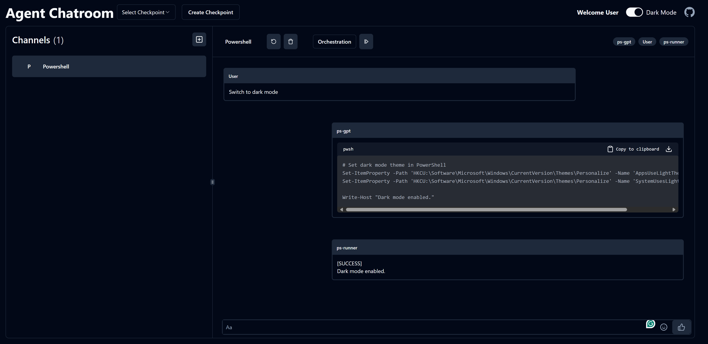

## Agent Chatroom
#### An extensible multi-agent platform built on top of AutoGen.Net and Orleans.

[](https://badge.fury.io/nu/ChatRoom.Client) | [website](https://littlelittlecloud.github.io/Agent-ChatRoom/) | Join our [Discord](https://discord.gg/UYwcVfGaeq)



## 🌟 Highlights
- **Multi-Agent WebUI**: Chat with multiple agents simultaneously in a web browser.
- **Server mode**: You can run `ChatRoom.Client` as a restful server. For more information, see [Server mode](#-server-mode).
- **Extensible**: Create your own agents and integrate them into the chatroom.

## 🚀 Quick Start
1. Install the `ChatRoom.Client` and `ChatRoom.OpenAI` tools from NuGet.
```bash
dotnet tool install -g ChatRoom.Client
dotnet tool install -g ChatRoom.OpenAI
```

2. Create configuration file for `ChatRoom.OpenAI` and save it to `chatroom-openai.json`
[!code-json[](./configuration/chatroom-openai.json)]

3. Create configuration file for `ChatRoom.Client` and save it to `chatroom-client.json`
[!code-json[](./configuration/chatroom-client.json)]

4. Start the `ChatRoom.Client` with the following command:
```bash
chatroom -c chatroom-client.json
```

You will see the following output similar to the following:
```bash
web ui is available at: http://localhost:51237;https://localhost:51238
```

Navigate to the web UI in your browser and start chatting with the agents.

## 📦 Pre-configured Chatrooms
We provide the following configuration to help you get started quickly. More configurations will be added in the future.
- [Powershell-Chatroom](https://github.com/LittleLittleCloud/Powershell-ChatRoom): chat with `ps-gpt` and `ps-runner` to help you write and run PowerShell scripts.

## 🌐 Server mode
To start a restful backend from `ChatRoom.Client`, add a `server_config` section to the client configuration file.

> [!Note]
> You can find the complete configuration sample in [chatroom-client-server.json](configuration/chatroom-client-server.json)

```json
// file: chatroom-client-server.json
"server_config": {
    "environment": "Development", // one of Development, Staging, Production.
    "urls": "http://localhost:51234;https://localhost:51235"
}
```

Then, run the following command to start the server. And the server will start on the `http://localhost:51234` and `https://localhost:51235`.

```bash
chatroom -c chatroom-client-server.json
```

### Swagger UI for the server
When the environment is set to `Development`, the server will automatically start the Swagger UI at `/swagger` and `/swagger/index.html`. You can also access the complete swagger schema at `/swagger/v1/swagger.json`, or visit [swagger-schema.json](schema/chatroom_client_swagger_schema.json) in this repository.
