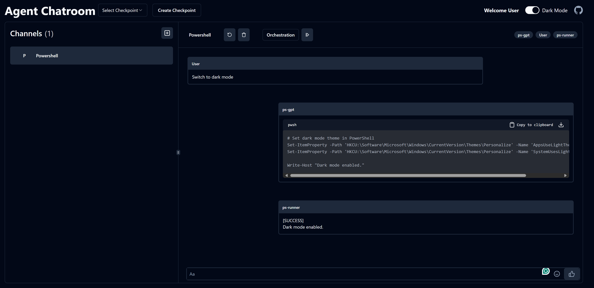

## Multi-agent WebUI for Agent Chatroom

### Overview
This project contains the web UI for the Agent Chatroom. It is built with Next.js, shadcn-ui, and tailwindcss.



## Getting Started

The web UI is a pure static website so you need to connect to the chatroom server to get it work. You can start the chatroom server by starting the `ChatRoom.Client` with the `server_config` section in the configuration file. For more information, see [Server mode](https://littlelittlecloud.github.io/Agent-ChatRoom/#-server-mode).

Once the chatroom server is started, you can start the web UI by running the following command:

```bash
npm install
npm run dev
```

## Configure the backend url
By default the web UI will connect to the chatroom server at `http://localhost:51234`. If you want to change the backend url, you can modify the `baseUrl` in the [OpenAPI.ts](chatroom-client/core/OpenAPI.ts) file.
