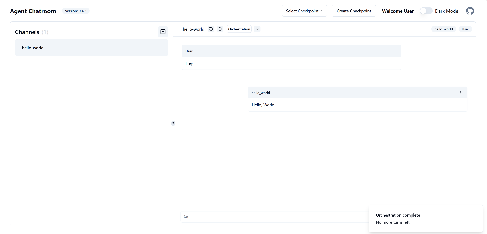

You can add AutoGen agent from your project to **Agent ChatRoom** using a code-first approach. First, you need to configure the chatroom services to either start a in-proc server or connect to an out-proc one. Then you create a @ChatRoom.SDK.ChatPlatformClient from configured services and use it to interact with the chatroom server. Finally, you can add an AutoGen agent to the chatroom by calling the @ChatRoom.SDK.ChatPlatformClient.RegisterAutoGenAgentAsync method on the `ChatPlatformClient` object.

[](https://github.com/LittleLittleCloud/Agent-ChatRoom/blob/main/example/dotnet/hello-world/Program.cs)

> [!Note]
> `AutoGen.Net` is the .NET implementation of the AutoGen framework. It provides first-class support for connecting to various LLM platforms, tool-call usage, group chat and more. You can find more information and tutorial about `AutoGen.Net` [here](https://microsoft.github.io/autogen-for-net/index.html)

In the rest of tutorial, we will show you how to add an AutoGen agent to the chatroom using the code-first approach step by step.

## Step 1: Create an empty console project and install the ChatRoom SDK and AutoGen.Net

To create a new console project, open a terminal and run the following command:

```bash
dotnet new console -n hello-world
cd hello-world
```

Next, install the following NuGet packages:

```bash
dotnet add package ChatRoom.SDK
dotnet add package ChatRoom.StaticWebUI # the artifacts for web-based chatroom UI
```

## Step 2: Create an in-proc chatroom server and connect to it

>[!TIP]
> ### in-proc VS out-proc
> - In-proc: The chatroom server runs in the same process as the client project. Client will configure and start the server.
> - Out-proc: The chatroom server runs in a separate process. Client will connect to the server using room name and port number.

In this step, we will create an in-proc chatroom server and start it. Note that we are using the in-proc mode, we also need to provide a `ServerConfig` object to chatroom server configuration.

[!code-csharp[program](../../example/dotnet/hello-world/Program.cs?name=start_chatroom_server)]

## Step 3: Create a dummy AutoGen agent that always returns `Hello, World!`

In this step, we will create a dummy AutoGen agent that always returns `Hello, World!`. First, create a new class named `HelloWorldAgent` in the project, and implement the `IAgent` interface:

[!code-csharp[hello_world_agent](../../example/dotnet/hello-world/Program.cs?name=hello_world_agent)]

## Step 4: Get `ChatPlatformClient` from service collections and register the hello-world agent

The @ChatRoom.SDK.ChatPlatformClient is the entry point to interact with chatroom server. You can use it to programmatically interact with the chatroom server.

In this step, we will get the `ChatPlatformClient` instance from service collections and register the `hello-wrold` agent to the chatroom server. Once the agent is registered, you can use the chatroom UI to interact with the agent.

[!code-csharp[register_agent](../../example/dotnet/hello-world/Program.cs?name=get_chatroom_client)]

## Final Step: Run the chatroom server
Now all the code is ready. You can run the chatroom server by running the console project. After the server is started, you can open a web browser and navigate to `http://localhost:50001` to use the web-based chatroom UI.

```bash
dotnet run
```



## Conclusion
In this tutorial, we have shown you how to add an AutoGen agent to the chatroom using the code-first approach. You can use the same approach to add other AutoGen agents to the chatroom. If you have any questions or feedback, please feel free to contact us.
