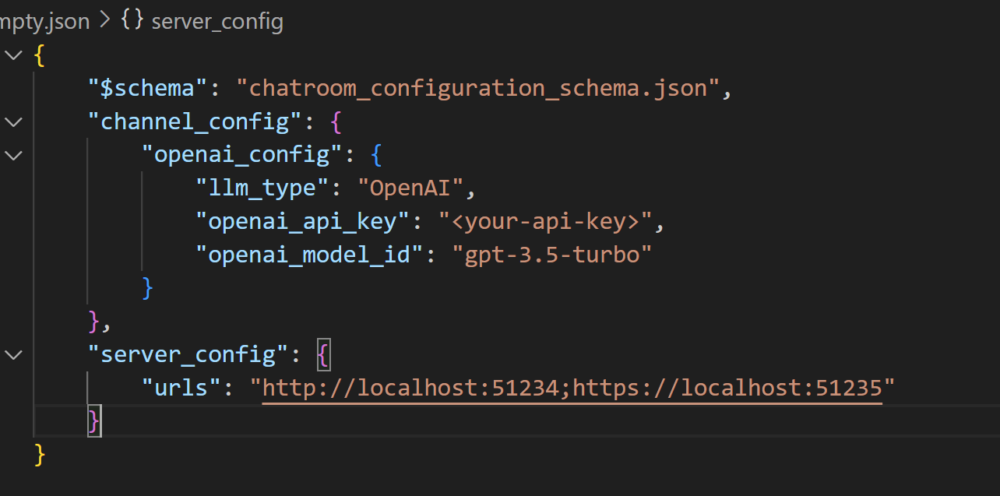
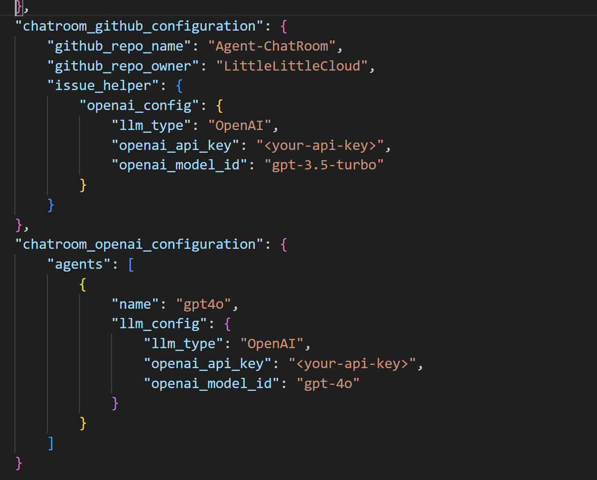
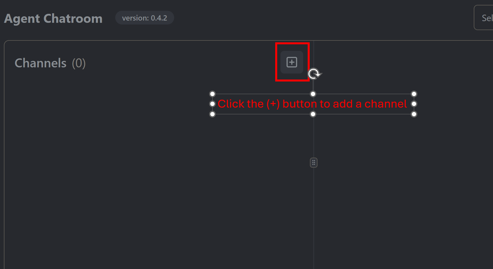
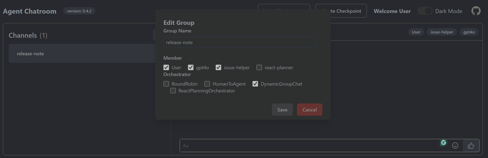
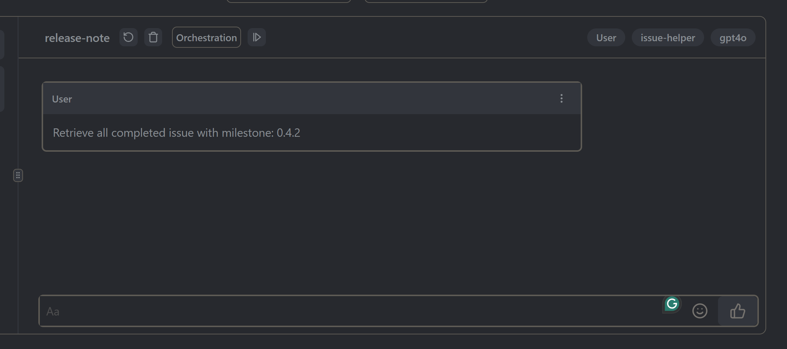
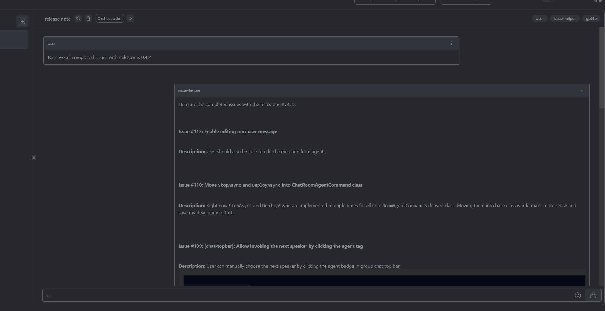
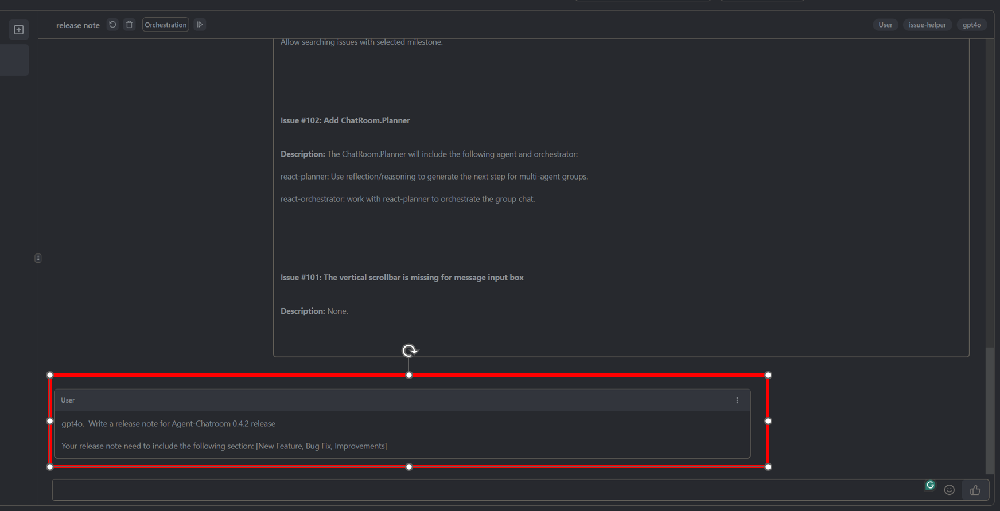
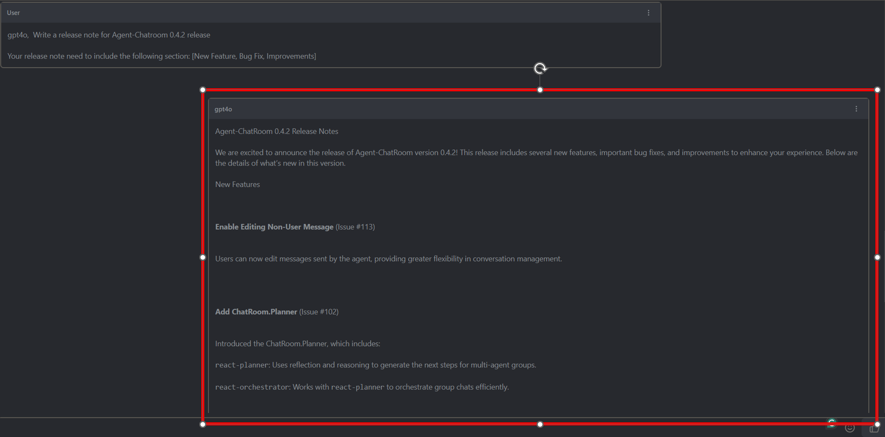

This tutorial introduce how the release notes of `Agent-Chatroom`  is written using `Agent-Chatroom` and github agents. The release notes are generated based on the completed issue in the milestone of the project. The release notes are written in markdown format and are displayed on the [release notes](../release_notes/) page.

## Overview
There are two main steps to write the release notes of `Agent-Chatroom`:
- retrieve the completed issues in the milestone using `issue-helper` from `ChatRoom.Github`.
- use openai agent like `gpt-4o` to generate the release notes based on the completed issues.

## Installation and configuration
Make sure you follow the [installation guide](./installation.md) to install the `Agent-Chatroom` properly. Once you have installed the `Agent-Chatroom`, you would need to configure both the `ChatRoom.Github` and `ChatRoom.OpenAI` agents so you can use them in the chatroom by following the below steps:

```bash
chatroom create -t chatroom_empty -o config.json # create a chatroom with empty configuration and save it to config.json
```

This will create a chatroom with empty configuration and save it to `config.json` along with a schema which helps you with intellisense in the configuration file when you open it in modern code editors like Visual Studio Code.



Next, you need to add the configuration for `ChatRoom.Github` and `ChatRoom.OpenAI` agents in the `config.json` file. You can add the configuration for `ChatRoom.Github` agent as shown below:



You can also download the complete configuration file from [here](../images/write_release_notes/complete-config.json). Remember to replace the `<your-api-key>` with your actual api key before using the configuration file.

Once you have added the configuration for `ChatRoom.Github` and `ChatRoom.OpenAI` agents, you can start the chatroom with the following command and navigate to the chatroom webui which runs at `http://localhost:51234` and `https://localhost:51235`:

```bash
chatroom run -c config.json
```

## Create channel with issue-helper and gpt4o agent

Once you have started the chatroom, you can create a channel with `issue-helper` and `gpt4o` agent by clicking on the `+` button in the chatroom webui and selecting the `issue-helper` and `gpt4o` agents from the list of available agents. Make sure you also select `DynamicGroupChat` orchestrator when configuring the channel. The `DynamicGroupChat` will use LLM to smartly select the next agent to respond to the user message.





Once you create `release-note` channel, navigate to the channel by clicking on the channel name and start the conversation.

## Generate release notes
To generate the release note for milestone: xxx, the first step is to retrieve all the completed issues in the milestone using the `issue-helper` agent. You can do this by sending the following message to the `release-note` channel:





The `issue-helper` agent will respond with the list of completed issues in the milestone. You can then use the `gpt4o` agent to generate the release notes based on the completed issues. You can do this by sending the following message to the `release-note` channel:




The `gpt4o` agent will respond with the release notes generated based on the completed issues in the milestone. After the release note are generated, you can ask `gpt4o` to improve the release note (if needed) or save the release note for further use.

## Conclusion
This tutorial introduced how the release notes of `Agent-Chatroom` is written using `Agent-Chatroom` and github agents. The release notes are generated based on the completed issue in the milestone of the project. The release notes are written in markdown format and are displayed on the [release notes](../release_notes/) page.